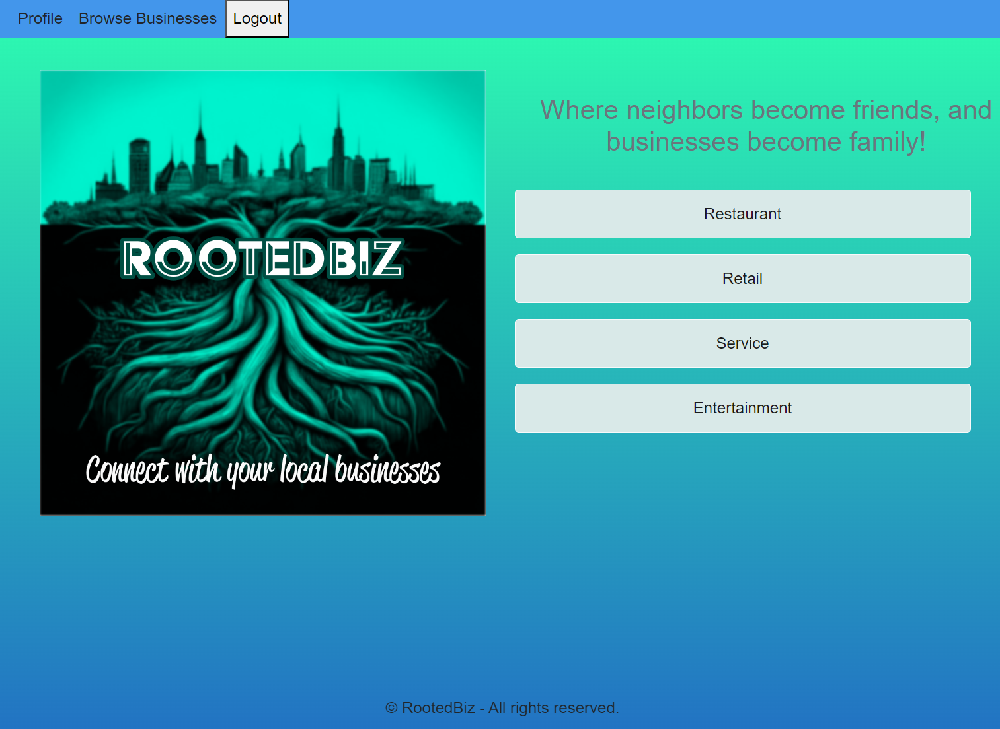
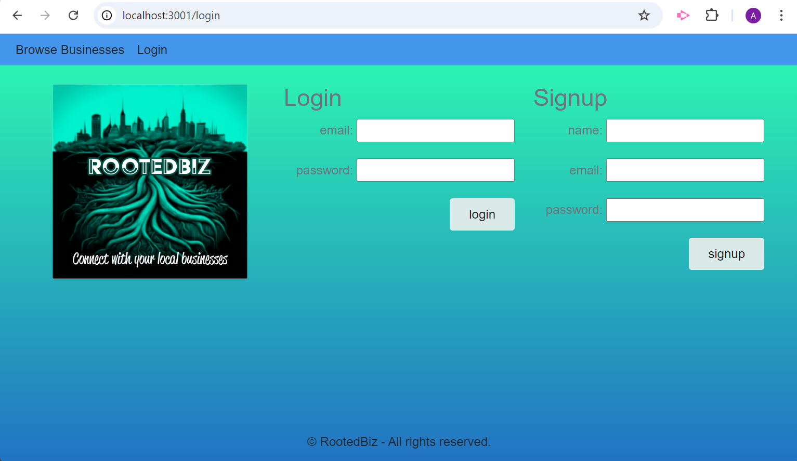
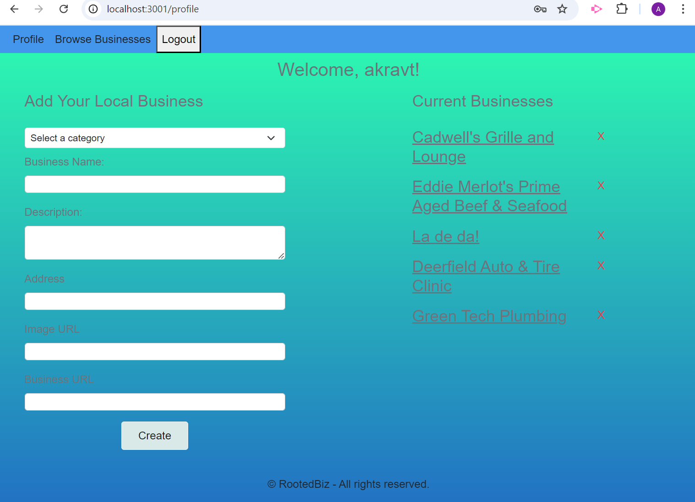
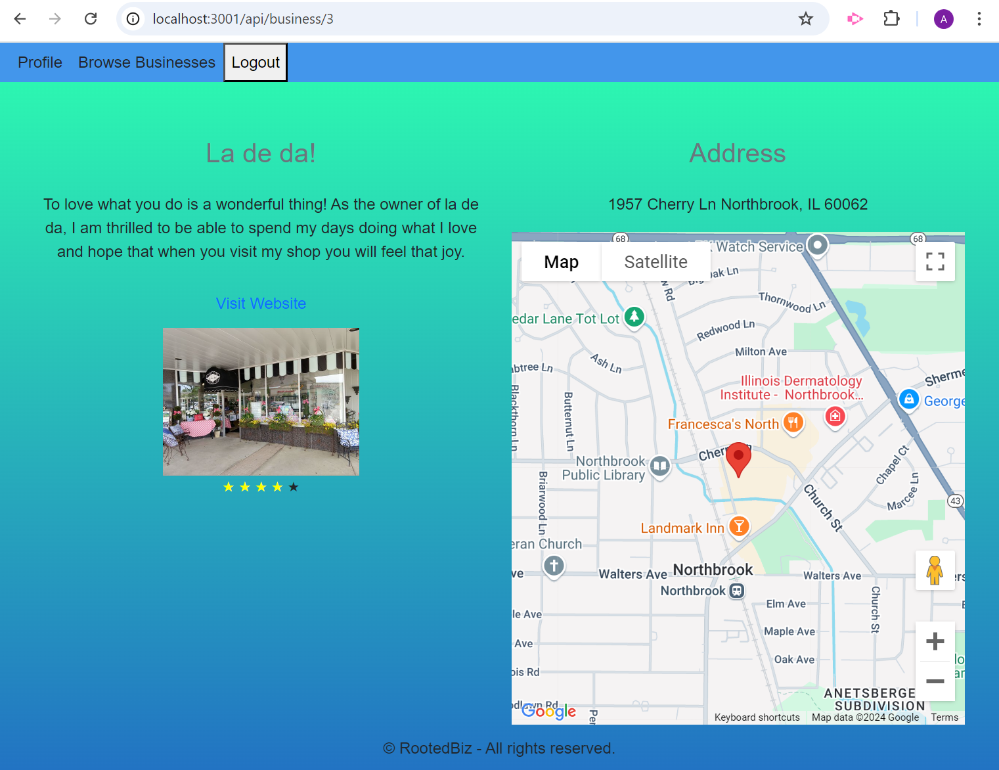

# Interactive Full-Stack Project

## Description
RootedBiz is a local business directory and review platform designed to help users discover and support businesses in their community. Users can explore a wide range of businesses across various categories like restaurants, retail, services, and entertainment. Each business has reviews and ratings provided by users to help others make informed decisions. The platform offers personalized recommendations based on user preferences and reviews, making it easier to find businesses that match their needs.

## Table of Contents
* [User Story](#userstory)
* [Technology Used](#technologyused)
* [Installation](#installation)
* [Usage](#usage)
* [Screenshots](#screenshots)
* [Review](#review)
* [Contact](#contact)

## User Story
As a local business owner,
I want to showcase my business to the community,
So that I can grow my customer base and contribute to the local small business economy.
As a customer,
I want to browse and review local businesses,
So that I can easily find trusted services and support my local community.

## Technology Used
- Node.js and Express.js to create a RESTful API.
- Handlebars.js as the templating engine.
- PostgreSQL and the Sequelize ORM for the database.
- GET, POST, PUT, DELETE routes for retrieving, adding, updating and deleting data.
- google.maps API.
- A folder structure that meets the MVC paradigm.
- Include authentication (express-session and cookies).
- Protect sensitive information with environment variables.
- Deployed using Render (with data).

## Installation
Clone this project repository to your computer. 
Use the terminal to run the commands:
- use the command "npm install" to install application dependecies;
- add business categories by running query in the "test.sql" file.

## Usage
Navigate to the project folder in the terminal. Invoke the application by typing "node server.js" in the terminal's command line. 

## Screenshots
The landing page:

The login & sign up pages:

The profile page displayed after user logs in and allows user to add a business, view an existing business, delete a business:

Business details page provides user with business description, allows to view the map (google map), visit business web site, and rate the business:

## Review
The URL of the functional, deployed application: https://rootedbiz-k658.onrender.com

The URL of the GitHub repository: https://github.com/akravt1274/RootedBiz

## Contact
Contact me with any ideas or requests: akravt1274@gmail.com, chasew2400@gmail.com, briannapirro1990@gmail.com.